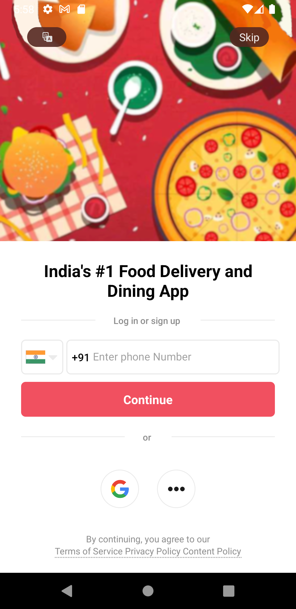
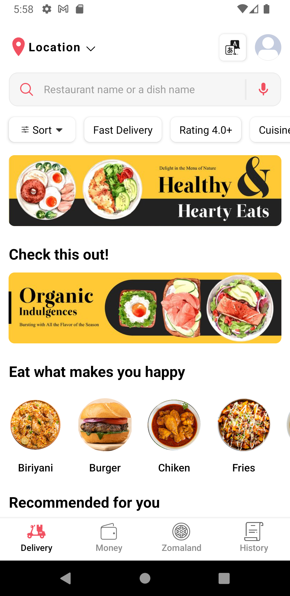
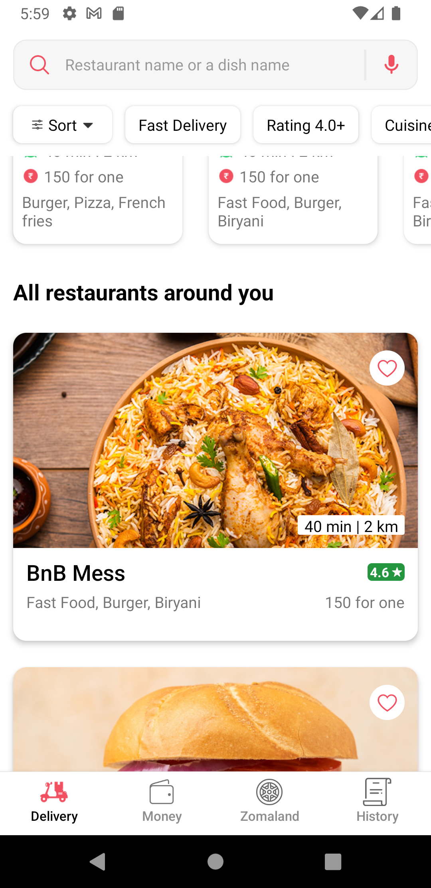
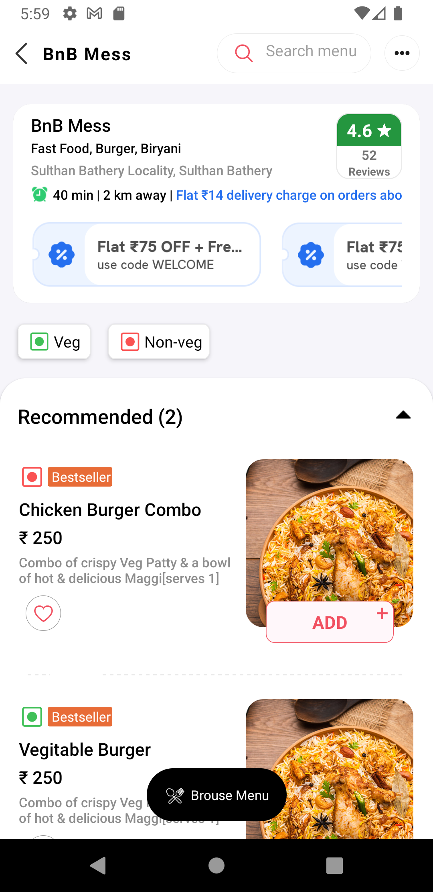
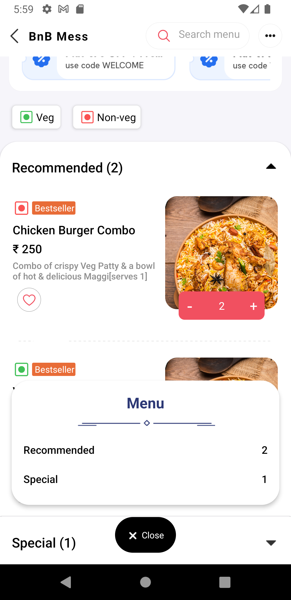

# Zomato Clone

Clone of a popular food delivery app, Zomato. 

 

### Languages & tools :
[][js]
[][react]

  

## Screenshots

|Auth Screen|OTP Screen|Delivery Screen|
|----|----|----|
||||
|Delivery Screen|Restaurant Screen| Restaurant Screen|
||||

## Connect with me:  

  
  
 

[react]: https://github.com/AbhilashTUofficial/React-Native-Programming
[js]: https://github.com/AbhilashTUofficial/JavaScript-programming

